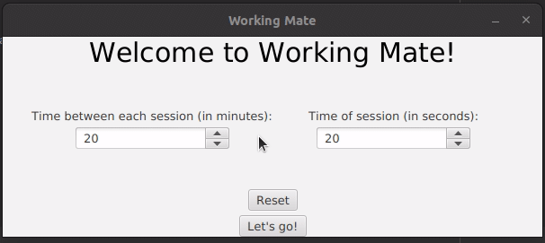

# Working mate

## "What is this?"
Working mate (WM for short) is a friendly JavaFX program who preserve your eyes from the damages caused by monitors.

## "Oh nice, but how?"
It relies on a pretty simple exercise : you make a session every 20 minutes of work. During these sessions you have to focus on a far enough object (around 6 m) for 20 seconds.

## "What does WM do?"
Basically WM informs you whether it's time to start a session or it's time to end it.
You can change timings before starting the exercise.

## "How do I get it?"
You can download it as a [Windows executable]() or as a [Linux Binary]().
You can clone this directory as well and build a jar file like this : 

```shell
git clone 'insert link'
cd 'Working_Mate'
javac 'to compelete'
```

## "How do I use it?" 
At startup, you choose the time between two sessions and the duration of a session.
A counter will spawn to keep track (I plan to add an option to disable it)



After this, you can work until WM reminds you to start a session with a tune like this

https://youtu.be/LGQbi9aXXRk

And will tell you to stop with this one

https://youtu.be/kyTMymEwRcY

You can stop WM by just closing the window ~~or by stopping via the icon on the right of your taskbar~~.
